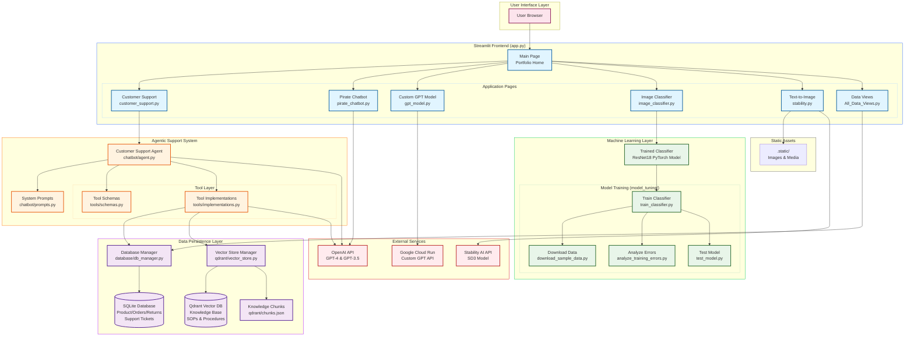

# Resume App - Complete Architecture Diagram

This diagram shows the complete architecture of the AI Portfolio application, including all pages, modules, and external services.



## Architecture Overview

### Frontend Layer (Streamlit)
The application is built as a Streamlit multi-page app with:
- **Main Page** (`app.py`): Portfolio landing page with navigation
- **6 Feature Pages**: Each showcasing different AI/ML capabilities

### Application Pages

#### 1. Customer Support Chatbot (`customer_support.py`)
- Full agentic AI system with function calling
- Integrates with database, vector store, and OpenAI
- Uses tool-based architecture for extensibility
- **Key Features**:
  - Order management (draft, place, track, cancel, modify)
  - Product search and recommendations
  - Return/refund processing
  - Knowledge base integration (RAG)
  - Support ticket management

#### 2. Pirate Chatbot (`pirate_chatbot.py`)
- Simple conversational AI with customizable system prompts
- Direct OpenAI API integration
- Demonstrates prompt engineering

#### 3. Custom GPT Model (`gpt_model.py`)
- 10-million parameter GPT model trained from scratch
- Deployed on Google Cloud Run
- Character-level text generation
- **Parameters**: seed, temperature, max_tokens, context

#### 4. Image Classifier (`image_classifier.py`)
- PyTorch ResNet18 transfer learning
- Classes: bird, plane, superman, other (via confidence threshold)
- Custom training pipeline in `model_tuning/`

#### 5. Text-to-Image Generator (`stability.py`)
- Stability AI SD3 model integration
- Prompt-to-image generation
- Image download capability

#### 6. All Data Views (`All_Data_Views.py`)
- Database visualization dashboard
- Shows products, orders, shipping rates, support tickets, returns, and KB chunks

### Agentic Support System

#### Customer Support Agent (`chatbot/agent.py`)
- OpenAI GPT-4 powered conversational agent
- Function calling for tool execution
- Context management and conversation history
- **Capabilities**:
  - Natural language understanding
  - Multi-turn conversations
  - Tool orchestration
  - Error handling and recovery

#### Tool Architecture
- **Schemas** (`tools/schemas.py`): OpenAI function definitions
- **Implementations** (`tools/implementations.py`): Actual tool logic
- **Available Tools**:
  - `draft_order`: Validate order information
  - `place_order`: Create orders in database
  - `search_products`: Find products by criteria
  - `get_order_status`: Track order status
  - `cancel_order`: Cancel existing orders
  - `search_knowledge_base`: RAG-based knowledge retrieval
  - `create_support_ticket`: Log customer issues
  - `initiate_return`: Process returns
  - And more...

### Data Layer

#### SQLite Database (`database/`)
- **Schema** (`schema.sql`): Relational database structure
- **Tables**:
  - Products: Product catalog with pricing and inventory
  - Orders: Customer orders with status tracking
  - Returns: Return requests and processing
  - Support Tickets: Customer support history
  - Shipping Rates: Shipping calculation data
- **Manager** (`db_manager.py`): 917 lines of database operations

#### Qdrant Vector Database (`qdrant/`)
- **Purpose**: Knowledge base storage and semantic search
- **Contents**: SOPs, procedures, company policies
- **Vector Store** (`vector_store.py`): Embeddings and similarity search
- **Chunks** (`chunks.json`): Pre-chunked knowledge base documents
- **Use Case**: RAG (Retrieval Augmented Generation) for agent responses

### Machine Learning Layer

#### Model Training Pipeline (`model_tuning/`)
Complete workflow for training custom image classifiers:
- **Data Collection**:
  - `download_sample_data.py`: Create dataset structure
  - `download_images.py`: Web image collection
  - `generate_test_images.py`: Synthetic data generation
- **Training**:
  - `train_classifier.py`: PyTorch training loop
  - Transfer learning from ResNet18
  - Data augmentation and validation
- **Evaluation**:
  - `test_model.py`: Model testing
  - `analyze_training_errors.py`: Error analysis
- **Documentation**:
  - `README.md`, `QUICKSTART.md`: Setup guides
  - `COMPLETE_WORKFLOW.md`: End-to-end process
  - `ADVANCED_FEATURES.md`: Advanced techniques

### External Services

#### OpenAI API
- **Models Used**: GPT-4, GPT-3.5-turbo
- **Use Cases**:
  - Customer support agent (function calling)
  - Pirate chatbot (chat completions)
  - Knowledge base embeddings

#### Stability AI API
- **Model**: Stable Diffusion 3 (SD3)
- **Use Case**: Text-to-image generation
- **Features**: Prompt-based image synthesis

#### Google Cloud Run
- **Service**: Custom GPT model inference
- **Deployment**: Containerized PyTorch model
- **API**: REST endpoints for text generation

## Data Flow Examples

### Customer Support Query Flow
1. User sends message via Streamlit UI
2. Agent (`chatbot/agent.py`) receives message
3. Agent calls OpenAI with system prompt and available tools
4. OpenAI decides which tools to call (e.g., `search_products`)
5. Tool implementation (`tools/implementations.py`) executes
6. Tool queries database or vector store as needed
7. Results returned to OpenAI for synthesis
8. Agent returns natural language response to UI

### Image Classification Flow
1. User uploads image via Streamlit UI
2. Image preprocessed (resize, normalize)
3. PyTorch model performs inference
4. Confidence thresholding applied
5. Predictions displayed with probabilities

### Text Generation Flow (Custom GPT)
1. User configures parameters in UI
2. Request sent to Google Cloud Run API
3. Model generates text character-by-character
4. Response streamed back to UI

## Technology Stack

### Frontend
- **Streamlit**: Web UI framework
- **Python**: Primary language

### Backend
- **SQLite**: Relational database
- **Qdrant**: Vector database

### AI/ML
- **PyTorch**: Deep learning framework
- **Transformers**: NLP models (for embeddings)
- **OpenAI**: LLM services
- **Stability AI**: Image generation

### Infrastructure
- **Google Cloud Run**: Model hosting
- **Docker**: Containerization (for Cloud Run)

## File Structure
```
resume-app/
├── app.py                    # Main entry point
├── pages/                    # Streamlit pages
│   ├── customer_support.py   # Agentic chatbot
│   ├── pirate_chatbot.py     # Simple chatbot
│   ├── gpt_model.py          # Custom GPT interface
│   ├── image_classifier.py   # Image classification
│   ├── stability.py          # Text-to-image
│   └── All_Data_Views.py     # Data dashboard
├── chatbot/                  # Agent implementation
│   ├── agent.py              # Core agent logic
│   └── prompts.py            # System prompts
├── tools/                    # Tool architecture
│   ├── schemas.py            # Function definitions
│   └── implementations.py    # Tool logic
├── database/                 # Data persistence
│   ├── db_manager.py         # Database operations
│   ├── schema.sql            # Table definitions
│   └── *_insert.sql          # Sample data
├── qdrant/                   # Vector storage
│   ├── vector_store.py       # Vector operations
│   └── chunks.json           # Knowledge base
├── model_tuning/             # ML training
│   ├── train_classifier.py   # Training script
│   ├── test_model.py         # Evaluation
│   └── *.md                  # Documentation
└── .static/                  # Static assets
```

## Key Features

### Agentic Architecture
- **Tool-based design**: Extensible function calling
- **Semantic search**: RAG for knowledge retrieval
- **State management**: Conversation context tracking
- **Error handling**: Graceful degradation

### Multi-Modal Capabilities
- **Text Generation**: GPT-3.5, GPT-4, Custom GPT
- **Image Generation**: Stability AI SD3
- **Image Classification**: Custom PyTorch models
- **Knowledge Retrieval**: Vector similarity search

### Production-Ready Features
- **Database management**: Full CRUD operations
- **API integrations**: Multiple external services
- **Model deployment**: Cloud-hosted inference
- **Error logging**: Comprehensive debugging

## Future Enhancements
- WebSocket support for real-time updates
- User authentication and session management
- Expanded tool library for agent
- Multi-language support
- Performance monitoring and analytics
