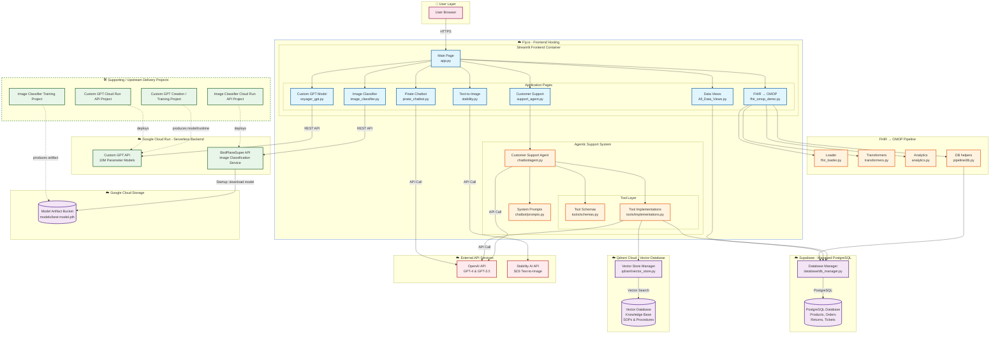

# Resume App - Serverless Architecture Diagram

This diagram shows the complete **serverless/cloud-native** architecture of the AI Portfolio application, including deployment infrastructure, application components, and external services.

## Architecture Type: **Serverless / Cloud-Native**

All components are hosted on managed cloud services with automatic scaling and no server management required.


```mermaid
---
config:
  layout: dagre
---
flowchart TB
 subgraph User["👤 User Layer"]
        BROWSER["User Browser"]
  end
 subgraph SupportingProjects["🛠️ Supporting / Upstream Delivery Projects"]
        GPTTRAIN["Custom GPT Creation / Training Project"]
        GPTAPI_PROJ["Custom GPT Cloud Run API Project"]
        IMGTRAIN["Image Classifier Training Project"]
        IMGAPI_PROJ["Image Classifier Cloud Run API Project"]
  end
 subgraph Pages["Application Pages"]
        CS["Customer Support<br>support_agent.py"]
        PC["Pirate Chatbot<br>pirate_chatbot.py"]
        GPT["Custom GPT Model<br>voyager_gpt.py"]
        IC["Image Classifier<br>image_classifier.py"]
        STAB["Text-to-Image<br>stability.py"]
        ADV["Data Views<br>All_Data_Views.py"]
        FHIR["FHIR → OMOP<br>fhir_omop_demo.py"]
  end
 subgraph FHIROMOP["FHIR → OMOP Pipeline"]
        FLOADER["Loader<br>fhir_loader.py"]
        FTRANS["Transformers<br>transformers.py"]
        FANAL["Analytics<br>analytics.py"]
        FDB["DB helpers<br>pipeline/db.py"]
  end
 subgraph Frontend["Streamlit Frontend Container"]
        MAIN["Main Page<br>app.py"]
        Pages
  end
 subgraph Tools["Tool Layer"]
        TSCHEMA["Tool Schemas<br>tools/schemas.py"]
        TIMPL["Tool Implementations<br>tools/implementations.py"]
  end
 subgraph AgenticSystem["Agentic Support System"]
        AGENT["Customer Support Agent<br>chatbot/agent.py"]
        PROMPTS["System Prompts<br>chatbot/prompts.py"]
        Tools
  end
 subgraph FlyIO["☁️ Fly.io - Frontend Hosting"]
        Frontend
        AgenticSystem
  end
 subgraph Supabase["☁️ Supabase - Managed PostgreSQL"]
        DB[("PostgreSQL Database<br>Products, Orders<br>Returns, Tickets")]
        DBMGR["Database Manager<br>database/db_manager.py"]
  end
 subgraph QdrantCloud["☁️ Qdrant Cloud - Vector Database"]
        VSTORE[("Vector Database<br>Knowledge Base<br>SOPs &amp; Procedures")]
        VSTMGR["Vector Store Manager<br>qdrant/vector_store.py"]
  end
 subgraph CloudRun["☁️ Google Cloud Run - Serverless Backend"]
        CUSTOMGPT["Custom GPT API<br>10M Parameter Models"]
        BPSAPI["BirdPlaneSuper API<br>Image Classification Service"]
  end
 subgraph GCS["☁️ Google Cloud Storage"]
        BPSMODEL[("Model Artifact Bucket<br>models/best-model.pth")]
  end
 subgraph ExternalAPIs["☁️ External API Services"]
        OPENAI["OpenAI API<br>GPT-4 &amp; GPT-3.5"]
        STABILITY["Stability AI API<br>SD3 Text-to-Image"]
  end
    BROWSER -- HTTPS --> MAIN
    MAIN --> CS & PC & GPT & IC & STAB & ADV & FHIR
    CS --> AGENT
    AGENT --> PROMPTS & TSCHEMA & TIMPL
    AGENT -- API Call --> OPENAI
    TIMPL --> VSTMGR & DBMGR
    TIMPL -- API Call --> OPENAI
    DBMGR -- PostgreSQL --> DB
    VSTMGR -- Vector Search --> VSTORE
    PC -- API Call --> OPENAI
    GPT -- REST API --> CUSTOMGPT
    IC -- REST API --> BPSAPI
    BPSAPI -- Startup: download model --> BPSMODEL
    STAB -- API Call --> STABILITY
    ADV --> DBMGR
    FHIR --> FLOADER & FTRANS & FANAL & FDB
    FDB --> DBMGR
    GPTTRAIN -. produces model/runtime .-> CUSTOMGPT
    GPTAPI_PROJ -. deploys .-> CUSTOMGPT
    IMGTRAIN -. produces artifact .-> BPSMODEL
    IMGAPI_PROJ -. deploys .-> BPSAPI
    GPTTRAIN ~~~ CUSTOMGPT
    GPTAPI_PROJ ~~~ CUSTOMGPT
    IMGTRAIN ~~~ BPSMODEL
    IMGAPI_PROJ ~~~ BPSAPI

     BROWSER:::user
     GPTTRAIN:::ml
     GPTAPI_PROJ:::ml
     IMGTRAIN:::ml
     IMGAPI_PROJ:::ml
     CS:::frontend
     PC:::frontend
     GPT:::frontend
     IC:::frontend
     STAB:::frontend
     ADV:::frontend
     FHIR:::frontend
     FLOADER:::agent
     FTRANS:::agent
     FANAL:::agent
     FDB:::agent
     MAIN:::frontend
     TSCHEMA:::agent
     TIMPL:::agent
     AGENT:::agent
     PROMPTS:::agent
     DB:::data
     DBMGR:::data
     VSTORE:::data
     VSTMGR:::data
     CUSTOMGPT:::ml
     BPSAPI:::ml
     BPSMODEL:::data
     OPENAI:::external
     STABILITY:::external
    classDef frontend fill:#e1f5ff,stroke:#01579b,stroke-width:2px
    classDef agent fill:#fff3e0,stroke:#e65100,stroke-width:2px
    classDef data fill:#f3e5f5,stroke:#4a148c,stroke-width:2px
    classDef ml fill:#e8f5e9,stroke:#1b5e20,stroke-width:2px
    classDef external fill:#ffebee,stroke:#b71c1c,stroke-width:2px
    classDef cloud fill:#e3f2fd,stroke:#1565c0,stroke-width:3px,stroke-dasharray: 5 5
    classDef user fill:#fce4ec,stroke:#880e4f,stroke-width:2px
    style FlyIO stroke:#2962FF
    style SupportingProjects stroke:#2e7d32,stroke-width:2px,stroke-dasharray: 5 5
```

## Deployment Infrastructure

### ☁️ Fly.io - Frontend Hosting
**Component**: Streamlit application in Docker container
- **Technology**: Docker containerization
- **Scaling**: Automatic horizontal scaling
- **Features**:
  - Multi-page Streamlit app
  - Agentic customer support system
  - PyTorch model inference
  - Static asset serving

### ☁️ Supabase - Database Hosting
**Component**: PostgreSQL relational database
- **Technology**: Managed PostgreSQL
- **Features**:
  - Products catalog
  - Order management
  - Returns processing
  - Support ticket tracking
- **Benefits**: Automatic backups, connection pooling, real-time capabilities

### ☁️ Qdrant Cloud - Vector Database
**Component**: Vector database for knowledge base
- **Technology**: Qdrant vector similarity search
- **Features**:
  - Knowledge base embeddings
  - SOPs and procedures
  - Semantic search capabilities
- **Use Case**: RAG (Retrieval Augmented Generation) for chatbot

### ☁️ Google Cloud Run - Backend Services
**Component**: Custom GPT model API
- **Technology**: Containerized PyTorch model
- **Features**:
  - 10-million parameter GPT model
  - Character-level text generation
  - Auto-scaling based on requests
- **Benefits**: Pay-per-request, zero idle costs

### ☁️ External API Services
**OpenAI API**:
- GPT-4 for customer support agent
- GPT-3.5-turbo for pirate chatbot
- Embeddings for vector search

**Stability AI API**:
- SD3 model for text-to-image generation

## Architecture Overview

### Why This is Serverless

1. **No Server Management**
   - All infrastructure is fully managed
   - No SSH access or server configuration needed
   - Automatic OS updates and security patches

2. **Automatic Scaling**
   - Fly.io: Scales containers based on traffic
   - Supabase: Connection pooling and read replicas
   - Qdrant Cloud: Managed scaling
   - Cloud Run: Scales to zero when idle

3. **Pay-per-Use Pricing**
   - Only pay for actual resource consumption
   - No cost for idle resources (especially Cloud Run)
   - Predictable pricing based on usage

4. **High Availability**
   - Built-in redundancy across all services
   - Automatic failover
   - Geographic distribution available

## Frontend Layer (Fly.io)

### Application Pages

#### 1. Customer Support Chatbot (`support_agent.py`)
Full agentic AI system with function calling capabilities.

**Key Features**:
- Order management (draft, place, track, cancel, modify)
- Product search and recommendations
- Return/refund processing
- Knowledge base integration (RAG)
- Support ticket management

**Architecture**:
- Agent orchestrator (`chatbot/agent.py`)
- Tool-based extensible design
- OpenAI GPT-4 function calling
- Vector database for knowledge retrieval

#### 2. Pirate Chatbot (`pirate_chatbot.py`)
Simple conversational AI with customizable system prompts.
- Direct OpenAI API integration
- Demonstrates prompt engineering
- Streaming responses

#### 3. Custom GPT Model (`voyager_gpt.py`)
Interface to custom-trained 10M parameter GPT models (Shakespeare + Voyager).
- Deployed on Google Cloud Run
- Character-level text generation
- Configurable parameters: model, seed, temperature, max_tokens, context
- Training pipeline lives in [brycegpt](https://github.com/BryceRodgers7/brycegpt)

#### 4. Image Classifier (`image_classifier.py`)
PyTorch ResNet50 transfer-learning classifier (frontend only — inference is remote).
- Classes: bird, plane, superman, other
- Confidence thresholding + entropy analysis for "other" detection
- Training pipeline lives in [img-classifier-birdplanesuper](https://github.com/BryceRodgers7/img-classifier-birdplanesuper)

#### 5. Text-to-Image Generator (`stability.py`)
Stability AI SD3 integration.
- Prompt-to-image generation
- Image download capability
- Result caching

#### 6. All Data Views (`All_Data_Views.py`)
Database visualization dashboard.
- Products, orders, shipping rates
- Support tickets, returns
- Knowledge base chunks

#### 7. FHIR → OMOP Demo (`fhir_omop_demo.py`)
Simplified healthcare interoperability demo — loads synthetic FHIR R4 bundles
into a raw JSONB landing zone, transforms them into an OMOP-inspired
relational schema, and surfaces analytics, a code-mapping report, and an
architecture-notes tab.

**Key Features**:
- Loads either bundled sample data or user-uploaded `.json` Bundles
- Single-transaction ingest (one Supabase round-trip per click)
- `st.status` panels with per-step progress and timings
- Status banner detects "loaded but not yet transformed" state
- Synthetic data only — no real clinical data, OMOP-*inspired* not OMOP-CDM-compliant

**Architecture**:
- Pipeline modules under `projects/fhir_omop/pipeline/`
  - `fhir_loader.py` — Bundle parsing + resource grouping
  - `transformers.py` — FHIR → OMOP row dicts + mapping report
  - `db.py` — thin helpers over `DatabaseManager`, plus `bulk_ingest_resources()` single-transaction ingest
  - `analytics.py` — dashboard SQL
- All tables live in the public schema with the `fhir_demo_` prefix
- DDL lives in `database/fhir_omop_sql/`

### Agentic Support System

#### Customer Support Agent (`chatbot/agent.py`)
OpenAI GPT-4 powered conversational agent with:
- Function calling for tool execution
- Context management
- Conversation history
- Error handling and recovery

#### Tool Architecture
- **Schemas** (`tools/schemas.py`): OpenAI function definitions
- **Implementations** (`tools/implementations.py`): Tool logic

**Available Tools**:
- `draft_order`: Validate order information
- `create_order`: Create orders in database
- `search_products`: Find products by criteria
- `get_order_status`: Track order status
- `cancel_order`: Cancel existing orders
- `search_knowledge_base`: RAG-based knowledge retrieval
- `create_support_ticket`: Log customer issues
- `initiate_return`: Process returns
- `get_shipping_cost`: Calculate shipping

## Data Layer

### Supabase PostgreSQL Database
**Schema** (`database/schema.sql`):
- **Products**: Catalog with pricing and inventory
- **Orders**: Customer orders with status tracking
- **Returns**: Return requests and processing
- **Support Tickets**: Customer support history
- **Shipping Rates**: Shipping calculation data

**Database Manager** (`database/db_manager.py`):
- 900+ lines of database operations
- Connection pooling
- Query optimization
- Transaction management

### Qdrant Vector Database
**Purpose**: Knowledge base storage and semantic search

**Contents**:
- SOPs (Standard Operating Procedures)
- Company policies
- Product information
- Support procedures

**Vector Store Manager** (`qdrant/vector_store.py`):
- Embeddings generation (OpenAI)
- Similarity search
- Relevance scoring

**Use Case**: RAG for agent responses
1. User asks question
2. Query embedded to vector
3. Similarity search in Qdrant
4. Relevant context retrieved
5. Context + query sent to GPT-4
6. Natural language response generated

## Data Flow Examples

### Customer Support Query Flow
```
1. User sends message via Streamlit UI (Fly.io)
2. Agent (chatbot/agent.py) receives message
3. Agent calls OpenAI API with system prompt and tools
4. OpenAI decides which tools to call (e.g., search_products)
5. Tool implementation executes:
   - Queries Supabase PostgreSQL database, OR
   - Queries Qdrant vector database, OR
   - Calls external API
6. Results returned to OpenAI for synthesis
7. Agent returns natural language response
8. UI displays response with tool usage tracking
```

### Image Classification Flow
```
1. User uploads image via Streamlit UI (Fly.io)
2. Image sent to Google Cloud Run API
3. Image preprocessed (resize 224x224, normalize)
4. PyTorch model performs inference
5. Response sent back to Fly.io
6. Predictions displayed with probabilities
```

### Custom GPT Generation Flow
```
1. User configures parameters (seed, temp, max_tokens)
2. Request sent to Google Cloud Run API
3. Model generates text
4. Response sent back to Fly.io
5. Display in Streamlit UI
```

### Text-to-Image Generation Flow
```
1. User enters text prompt
2. Request sent to Stability AI API
3. SD3 model generates image
4. Image returned and cached (Streamlit cache)
5. Display with download option
```

### FHIR → OMOP Pipeline Flow
```
1. User clicks "Load Sample FHIR Bundles" (or uploads files)
2. fhir_loader parses each Bundle JSON, groups resources by resourceType
3. demo_db.bulk_ingest_resources(...) opens ONE Supabase connection and runs:
   - INSERT into fhir_demo_ingestion_run (open the run)
   - INSERT VALUES into fhir_demo_raw_fhir_resource (the JSONB landing zone)
   - UPDATE fhir_demo_ingestion_run (close the run)
   All three in a single transaction — one round-trip per click.
4. User clicks "Run Transformation Pipeline"
5. demo_db.fetch_raw_resources_by_type pulls the landed JSONB back out
6. transformers map FHIR → OMOP-inspired row dicts; Patients insert first
   so downstream resources can resolve person_id
7. Bulk inserts populate person / visit_occurrence / condition_occurrence /
   measurement / drug_exposure
8. build_mapping_report_rows generates one row per coded resource
   indicating whether the source coding system was a recognized standard
   vocabulary (SNOMED, LOINC, RxNorm, ICD-10)
9. UI renders metric cards, OMOP tables, mapping report, analytics dashboard
```

## Technology Stack

### Frontend & Backend
- **Python 3.x**: Primary language
- **Streamlit**: Web UI framework
- **Docker**: Containerization

### Databases
- **PostgreSQL** (Supabase): Relational data
- **Qdrant**: Vector similarity search

### AI/ML Frameworks
- **PyTorch**: Deep learning framework
- **Transformers**: NLP models (embeddings)
- **OpenAI SDK**: LLM services
- **Stability AI SDK**: Image generation

### Cloud Infrastructure
- **Fly.io**: Frontend hosting
- **Supabase**: Database hosting
- **Qdrant Cloud**: Vector database
- **Google Cloud Run**: Backend services

### External Services
- **OpenAI API**: GPT-4, GPT-3.5, embeddings
- **Stability AI**: SD3 text-to-image

## Benefits of This Serverless Architecture

### 1. **Scalability**
- Automatic scaling based on demand
- No manual capacity planning
- Handles traffic spikes gracefully

### 2. **Cost Efficiency**
- Pay only for actual usage
- Cloud Run scales to zero (no idle costs)
- No over-provisioning needed

### 3. **Reliability**
- Managed services with SLAs
- Automatic failover and redundancy
- Built-in backup and recovery

### 4. **Developer Productivity**
- Focus on application code, not infrastructure
- Rapid deployment and iteration
- No server maintenance

### 5. **Global Performance**
- CDN integration (Fly.io)
- Geographic distribution available
- Low latency worldwide

## Deployment Workflow

### Current Setup
1. **Frontend** (Fly.io): Will be deployed via Docker
2. **Database** (Supabase): Already configured and running
3. **Vector DB** (Qdrant Cloud): Already configured and running
4. **Backend** (Cloud Run): Custom GPT model deployed

### Deployment Steps
1. Create Dockerfile for Streamlit app
2. Deploy to Fly.io using `fly deploy`
3. Configure environment variables (API keys, connection strings)
4. Monitor via Fly.io dashboard

### Environment Variables Required
```bash
# OpenAI (support agent, pirate chatbot, vector embeddings)
OPENAI_API_KEY=<key>

# Supabase PostgreSQL (full DSN — psycopg2 connection string)
SUPADATABASE_URL=<connection-string>

# Qdrant Cloud (vector knowledge base)
QDRANT_URL=<url>
QDRANT_API_KEY=<key>

# Stability AI (text-to-image)
STABILITY_KEY=<key>

# Cloud Run backends
BRYCEGPT_API_URL=<cloud-run-url>     # custom GPT inference
BPSIMGCLSS_API_URL=<cloud-run-url>   # image-classifier inference

# Optional
LOG_LEVEL=INFO            # root logger level
BPSIMGCLSS_TIMEOUT=120    # image classifier read-timeout seconds
```

## File Structure
```
resume-app/
├── app.py                      # Main entry point
├── Dockerfile                  # Container configuration
├── requirements.txt            # Python dependencies
├── pages/                      # Streamlit pages
│   ├── support_agent.py        # Agentic chatbot
│   ├── pirate_chatbot.py       # Simple chatbot
│   ├── voyager_gpt.py          # Custom GPT interface
│   ├── image_classifier.py     # Image classification
│   ├── stability.py            # Text-to-image
│   └── architecture.py         # Architecture diagram viewer
├── views/                      # Pages without sidebar links
│   ├── All_Data_Views.py       # Data dashboard
├── chatbot/                    # Agent implementation
│   ├── agent.py                # Core agent logic
│   └── prompts.py              # System prompts
├── tools/                      # Tool architecture
│   ├── schemas.py              # Function definitions
│   └── implementations.py      # Tool logic
├── database/                   # Data persistence
│   ├── db_manager.py           # Database operations
│   ├── schema.sql              # Table definitions (agent_* tables)
│   ├── *_insert.sql            # Sample data
│   └── fhir_omop_sql/          # DDL + reset for the FHIR → OMOP demo
│       ├── 001_create_tables.sql
│       └── 002_seed_reset.sql
├── qdrant/                     # Vector storage
│   ├── vector_store.py         # RAG Vector operations
│   ├── vector_load_kb.py       # Vector knowledgebase creation
│   ├── vector_load_onechunk.py # Vector db single-chunk manipulation
│   └── chunks.json             # Knowledge base
├── projects/                   # Self-contained portfolio sub-projects
│   └── fhir_omop/              # FHIR → OMOP demo
│       ├── README.md
│       ├── sample_data/        # Synthetic FHIR R4 Bundles
│       └── pipeline/           # db / fhir_loader / transformers / analytics
└── .static/                    # Static assets
    └── architecture.svg        # This diagram
    └── me.jpg                  # Bryce Rodgers selfie
    └── parrot.jpg              # First stability pic
```

## Key Features

### ✅ Fully Serverless
- Zero server management
- Automatic scaling
- Pay-per-use pricing

### ✅ Multi-Modal AI
- Text generation (GPT-3.5, GPT-4, Custom GPT)
- Image generation (Stability AI SD3)
- Image classification (PyTorch)
- Knowledge retrieval (Vector search)

### ✅ Production-Ready
- Database management
- API integrations
- Error handling
- Logging and monitoring

### ✅ Agentic Architecture
- Tool-based design
- Function calling
- RAG integration
- Context management

## Future Enhancements

### Infrastructure
- [ ] Multi-region deployment
- [ ] CDN for static assets
- [ ] Redis caching layer
- [ ] WebSocket support for real-time updates

### Features
- [ ] User authentication (Supabase Auth)
- [ ] Session management
- [ ] Rate limiting
- [ ] Analytics dashboard
- [ ] A/B testing framework

### Monitoring
- [ ] Application performance monitoring (APM)
- [ ] Error tracking (Sentry)
- [ ] Cost monitoring and alerts
- [ ] Usage analytics

---

**Built with**: Streamlit, PyTorch, OpenAI, Stability AI  
**Hosted on**: Fly.io, Supabase, Qdrant Cloud, Google Cloud Run  
**Architecture**: Serverless / Cloud-Native
