# Resume App - Serverless Architecture Diagram

This diagram shows the complete **serverless/cloud-native** architecture of the AI Portfolio application, including deployment infrastructure, application components, and external services.

## Architecture Type: **Serverless / Cloud-Native**

All components are hosted on managed cloud services with automatic scaling and no server management required.

```mermaid
flowchart TB
    subgraph User["👤 User Layer"]
        BROWSER[User Browser]
    end

    subgraph FlyIO["☁️ Fly.io - Frontend Hosting"]
        subgraph Frontend["Streamlit Frontend Container"]
            MAIN[Main Page<br/>app.py]
            
            subgraph Pages["Application Pages"]
                CS[Customer Support<br/>customer_support.py]
                PC[Pirate Chatbot<br/>pirate_chatbot.py]
                GPT[Custom GPT Model<br/>gpt_model.py]
                IC[Image Classifier<br/>image_classifier.py]
                STAB[Text-to-Image<br/>stability.py]
                ADV[Data Views<br/>All_Data_Views.py]
            end
        end

        subgraph AgenticSystem["Agentic Support System"]
            AGENT[Customer Support Agent<br/>chatbot/agent.py]
            PROMPTS[System Prompts<br/>chatbot/prompts.py]
            
            subgraph Tools["Tool Layer"]
                TSCHEMA[Tool Schemas<br/>tools/schemas.py]
                TIMPL[Tool Implementations<br/>tools/implementations.py]
            end
        end

        subgraph MLLayer["ML Layer"]
            MODEL[Trained Classifier<br/>ResNet18 PyTorch]
        end

        IMAGES[Static Assets<br/>.static/]
    end

    subgraph Supabase["☁️ Supabase - Managed PostgreSQL"]
        DB[(PostgreSQL Database<br/>Products, Orders<br/>Returns, Tickets)]
        DBMGR[Database Manager<br/>database/db_manager.py]
    end

    subgraph QdrantCloud["☁️ Qdrant Cloud - Vector Database"]
        VSTORE[(Vector Database<br/>Knowledge Base<br/>SOPs & Procedures)]
        VSTMGR[Vector Store Manager<br/>qdrant/vector_store.py]
    end

    subgraph CloudRun["☁️ Google Cloud Run - Serverless Backend"]
        CUSTOMGPT[Custom GPT API<br/>10M Parameter Model]
    end

    subgraph ExternalAPIs["☁️ External API Services"]
        OPENAI[OpenAI API<br/>GPT-4 & GPT-3.5]
        STABILITY[Stability AI API<br/>SD3 Text-to-Image]
    end

    %% User connections
    BROWSER -->|HTTPS| MAIN

    %% Frontend routing
    MAIN --> CS
    MAIN --> PC
    MAIN --> GPT
    MAIN --> IC
    MAIN --> STAB
    MAIN --> ADV

    %% Customer Support flow
    CS --> AGENT
    AGENT --> PROMPTS
    AGENT --> TSCHEMA
    AGENT --> TIMPL
    AGENT -->|API Call| OPENAI

    %% Tool implementations
    TIMPL --> DBMGR
    TIMPL --> VSTMGR
    TIMPL -->|API Call| OPENAI

    %% Database connections
    DBMGR -->|PostgreSQL| DB
    ADV --> DBMGR

    %% Vector store connections
    VSTMGR -->|Vector Search| VSTORE

    %% Other page connections
    PC -->|API Call| OPENAI
    GPT -->|REST API| CUSTOMGPT
    IC --> MODEL
    STAB --> IMAGES
    STAB -->|API Call| STABILITY

    %% Styling
    classDef frontend fill:#e1f5ff,stroke:#01579b,stroke-width:2px
    classDef agent fill:#fff3e0,stroke:#e65100,stroke-width:2px
    classDef data fill:#f3e5f5,stroke:#4a148c,stroke-width:2px
    classDef ml fill:#e8f5e9,stroke:#1b5e20,stroke-width:2px
    classDef external fill:#ffebee,stroke:#b71c1c,stroke-width:2px
    classDef cloud fill:#e3f2fd,stroke:#1565c0,stroke-width:3px,stroke-dasharray: 5 5
    classDef user fill:#fce4ec,stroke:#880e4f,stroke-width:2px

    class BROWSER user
    class MAIN,CS,PC,GPT,IC,STAB,ADV frontend
    class AGENT,PROMPTS,TSCHEMA,TIMPL agent
    class DB,DBMGR,VSTORE,VSTMGR data
    class MODEL,IMAGES ml
    class OPENAI,STABILITY,CUSTOMGPT external
```



## Deployment Infrastructure

### ☁️ Fly.io - Frontend Hosting
**Component**: Streamlit application in Docker container
- **Technology**: Docker containerization
- **Scaling**: Automatic horizontal scaling
- **Features**:
  - Multi-page Streamlit app
  - Agentic customer support system
  - PyTorch model inference
  - Static asset serving

### ☁️ Supabase - Database Hosting
**Component**: PostgreSQL relational database
- **Technology**: Managed PostgreSQL
- **Features**:
  - Products catalog
  - Order management
  - Returns processing
  - Support ticket tracking
- **Benefits**: Automatic backups, connection pooling, real-time capabilities

### ☁️ Qdrant Cloud - Vector Database
**Component**: Vector database for knowledge base
- **Technology**: Qdrant vector similarity search
- **Features**:
  - Knowledge base embeddings
  - SOPs and procedures
  - Semantic search capabilities
- **Use Case**: RAG (Retrieval Augmented Generation) for chatbot

### ☁️ Google Cloud Run - Backend Services
**Component**: Custom GPT model API
- **Technology**: Containerized PyTorch model
- **Features**:
  - 10-million parameter GPT model
  - Character-level text generation
  - Auto-scaling based on requests
- **Benefits**: Pay-per-request, zero idle costs

### ☁️ External API Services
**OpenAI API**:
- GPT-4 for customer support agent
- GPT-3.5-turbo for pirate chatbot
- Embeddings for vector search

**Stability AI API**:
- SD3 model for text-to-image generation

## Architecture Overview

### Why This is Serverless

1. **No Server Management**
   - All infrastructure is fully managed
   - No SSH access or server configuration needed
   - Automatic OS updates and security patches

2. **Automatic Scaling**
   - Fly.io: Scales containers based on traffic
   - Supabase: Connection pooling and read replicas
   - Qdrant Cloud: Managed scaling
   - Cloud Run: Scales to zero when idle

3. **Pay-per-Use Pricing**
   - Only pay for actual resource consumption
   - No cost for idle resources (especially Cloud Run)
   - Predictable pricing based on usage

4. **High Availability**
   - Built-in redundancy across all services
   - Automatic failover
   - Geographic distribution available

## Frontend Layer (Fly.io)

### Application Pages

#### 1. Customer Support Chatbot (`customer_support.py`)
Full agentic AI system with function calling capabilities.

**Key Features**:
- Order management (draft, place, track, cancel, modify)
- Product search and recommendations
- Return/refund processing
- Knowledge base integration (RAG)
- Support ticket management

**Architecture**:
- Agent orchestrator (`chatbot/agent.py`)
- Tool-based extensible design
- OpenAI GPT-4 function calling
- Vector database for knowledge retrieval

#### 2. Pirate Chatbot (`pirate_chatbot.py`)
Simple conversational AI with customizable system prompts.
- Direct OpenAI API integration
- Demonstrates prompt engineering
- Streaming responses

#### 3. Custom GPT Model (`gpt_model.py`)
Interface to custom-trained 10M parameter GPT model.
- Deployed on Google Cloud Run
- Character-level text generation
- Configurable parameters: seed, temperature, max_tokens

#### 4. Image Classifier (`image_classifier.py`)
PyTorch ResNet18 transfer learning classifier.
- Classes: bird, plane, superman, other
- Confidence thresholding for "other" detection
- Custom training pipeline in `model_tuning/`

#### 5. Text-to-Image Generator (`stability.py`)
Stability AI SD3 integration.
- Prompt-to-image generation
- Image download capability
- Result caching

#### 6. All Data Views (`All_Data_Views.py`)
Database visualization dashboard.
- Products, orders, shipping rates
- Support tickets, returns
- Knowledge base chunks

### Agentic Support System

#### Customer Support Agent (`chatbot/agent.py`)
OpenAI GPT-4 powered conversational agent with:
- Function calling for tool execution
- Context management
- Conversation history
- Error handling and recovery

#### Tool Architecture
- **Schemas** (`tools/schemas.py`): OpenAI function definitions
- **Implementations** (`tools/implementations.py`): Tool logic

**Available Tools**:
- `draft_order`: Validate order information
- `place_order`: Create orders in database
- `search_products`: Find products by criteria
- `get_order_status`: Track order status
- `cancel_order`: Cancel existing orders
- `modify_order`: Update order details
- `search_knowledge_base`: RAG-based knowledge retrieval
- `create_support_ticket`: Log customer issues
- `initiate_return`: Process returns
- `get_shipping_cost`: Calculate shipping
- And more...

## Data Layer

### Supabase PostgreSQL Database
**Schema** (`database/schema.sql`):
- **Products**: Catalog with pricing and inventory
- **Orders**: Customer orders with status tracking
- **Returns**: Return requests and processing
- **Support Tickets**: Customer support history
- **Shipping Rates**: Shipping calculation data

**Database Manager** (`database/db_manager.py`):
- 900+ lines of database operations
- Connection pooling
- Query optimization
- Transaction management

### Qdrant Vector Database
**Purpose**: Knowledge base storage and semantic search

**Contents**:
- SOPs (Standard Operating Procedures)
- Company policies
- Product information
- Support procedures

**Vector Store Manager** (`qdrant/vector_store.py`):
- Embeddings generation (OpenAI)
- Similarity search
- Relevance scoring

**Use Case**: RAG for agent responses
1. User asks question
2. Query embedded to vector
3. Similarity search in Qdrant
4. Relevant context retrieved
5. Context + query sent to GPT-4
6. Natural language response generated

## Machine Learning Layer

### PyTorch Image Classifier
**Architecture**: ResNet18 with transfer learning
- Pre-trained on ImageNet
- Fine-tuned on custom dataset
- Confidence thresholding for "other" class

### Model Training Pipeline (`model_tuning/`)
Complete workflow for training custom classifiers:

**Data Collection**:
- `download_sample_data.py`: Create dataset structure
- `download_images.py`: Web image collection
- `generate_test_images.py`: Synthetic data generation

**Training**:
- `train_classifier.py`: PyTorch training loop
- Data augmentation
- Validation split
- Early stopping

**Evaluation**:
- `test_model.py`: Model testing
- `analyze_training_errors.py`: Error analysis
- Confusion matrix generation

## Data Flow Examples

### Customer Support Query Flow
```
1. User sends message via Streamlit UI (Fly.io)
2. Agent (chatbot/agent.py) receives message
3. Agent calls OpenAI API with system prompt and tools
4. OpenAI decides which tools to call (e.g., search_products)
5. Tool implementation executes:
   - Queries Supabase PostgreSQL database, OR
   - Queries Qdrant vector database, OR
   - Calls external API
6. Results returned to OpenAI for synthesis
7. Agent returns natural language response
8. UI displays response with tool usage tracking
```

### Image Classification Flow
```
1. User uploads image via Streamlit UI (Fly.io)
2. Image preprocessed (resize 224x224, normalize)
3. PyTorch model performs inference (runs on Fly.io)
4. Confidence thresholding applied
5. Predictions displayed with probabilities
```

### Custom GPT Generation Flow
```
1. User configures parameters (seed, temp, max_tokens)
2. Request sent to Google Cloud Run API
3. Model generates text character-by-character
4. Response streamed back to Fly.io
5. Display in Streamlit UI
```

### Text-to-Image Generation Flow
```
1. User enters text prompt
2. Request sent to Stability AI API
3. SD3 model generates image
4. Image returned and cached (Streamlit cache)
5. Display with download option
```

## Technology Stack

### Frontend & Backend
- **Python 3.x**: Primary language
- **Streamlit**: Web UI framework
- **Docker**: Containerization

### Databases
- **PostgreSQL** (Supabase): Relational data
- **Qdrant**: Vector similarity search

### AI/ML Frameworks
- **PyTorch**: Deep learning framework
- **Transformers**: NLP models (embeddings)
- **OpenAI SDK**: LLM services
- **Stability AI SDK**: Image generation

### Cloud Infrastructure
- **Fly.io**: Frontend hosting
- **Supabase**: Database hosting
- **Qdrant Cloud**: Vector database
- **Google Cloud Run**: Backend services

### External Services
- **OpenAI API**: GPT-4, GPT-3.5, embeddings
- **Stability AI**: SD3 text-to-image

## Benefits of This Serverless Architecture

### 1. **Scalability**
- Automatic scaling based on demand
- No manual capacity planning
- Handles traffic spikes gracefully

### 2. **Cost Efficiency**
- Pay only for actual usage
- Cloud Run scales to zero (no idle costs)
- No over-provisioning needed

### 3. **Reliability**
- Managed services with SLAs
- Automatic failover and redundancy
- Built-in backup and recovery

### 4. **Developer Productivity**
- Focus on application code, not infrastructure
- Rapid deployment and iteration
- No server maintenance

### 5. **Global Performance**
- CDN integration (Fly.io)
- Geographic distribution available
- Low latency worldwide

## Deployment Workflow

### Current Setup
1. **Frontend** (Fly.io): Will be deployed via Docker
2. **Database** (Supabase): Already configured and running
3. **Vector DB** (Qdrant Cloud): Already configured and running
4. **Backend** (Cloud Run): Custom GPT model deployed

### Deployment Steps
1. Create Dockerfile for Streamlit app
2. Deploy to Fly.io using `fly deploy`
3. Configure environment variables (API keys, connection strings)
4. Monitor via Fly.io dashboard

### Environment Variables Required
```bash
# OpenAI
OPENAI_API_KEY=<key>

# Supabase
DATABASE_URL=<connection-string>
SUPABASE_URL=<url>
SUPABASE_KEY=<key>

# Qdrant
QDRANT_URL=<url>
QDRANT_API_KEY=<key>

# Stability AI
STABILITY_KEY=<key>

# Custom GPT
BRYCEGPT_API_URL=<cloud-run-url>
```

## File Structure
```
resume-app/
├── app.py                    # Main entry point
├── Dockerfile                # Container configuration (to be added)
├── requirements.txt          # Python dependencies
├── pages/                    # Streamlit pages
│   ├── customer_support.py   # Agentic chatbot
│   ├── pirate_chatbot.py     # Simple chatbot
│   ├── gpt_model.py          # Custom GPT interface
│   ├── image_classifier.py   # Image classification
│   ├── stability.py          # Text-to-image
│   ├── All_Data_Views.py     # Data dashboard
│   └── architecture.py       # Architecture diagram viewer
├── chatbot/                  # Agent implementation
│   ├── agent.py              # Core agent logic
│   └── prompts.py            # System prompts
├── tools/                    # Tool architecture
│   ├── schemas.py            # Function definitions
│   └── implementations.py    # Tool logic
├── database/                 # Data persistence
│   ├── db_manager.py         # Database operations
│   ├── schema.sql            # Table definitions
│   └── *_insert.sql          # Sample data
├── qdrant/                   # Vector storage
│   ├── vector_store.py       # Vector operations
│   └── chunks.json           # Knowledge base
├── model_tuning/             # ML training
│   ├── train_classifier.py   # Training script
│   ├── test_model.py         # Evaluation
│   └── *.md                  # Documentation
└── .static/                  # Static assets
    └── architecture.svg      # This diagram
```

## Key Features

### ✅ Fully Serverless
- Zero server management
- Automatic scaling
- Pay-per-use pricing

### ✅ Multi-Modal AI
- Text generation (GPT-3.5, GPT-4, Custom GPT)
- Image generation (Stability AI SD3)
- Image classification (PyTorch)
- Knowledge retrieval (Vector search)

### ✅ Production-Ready
- Database management
- API integrations
- Error handling
- Logging and monitoring

### ✅ Agentic Architecture
- Tool-based design
- Function calling
- RAG integration
- Context management

## Future Enhancements

### Infrastructure
- [ ] Multi-region deployment
- [ ] CDN for static assets
- [ ] Redis caching layer
- [ ] WebSocket support for real-time updates

### Features
- [ ] User authentication (Supabase Auth)
- [ ] Session management
- [ ] Rate limiting
- [ ] Analytics dashboard
- [ ] A/B testing framework

### Monitoring
- [ ] Application performance monitoring (APM)
- [ ] Error tracking (Sentry)
- [ ] Cost monitoring and alerts
- [ ] Usage analytics

---

**Built with**: Streamlit, PyTorch, OpenAI, Stability AI  
**Hosted on**: Fly.io, Supabase, Qdrant Cloud, Google Cloud Run  
**Architecture**: Serverless / Cloud-Native
